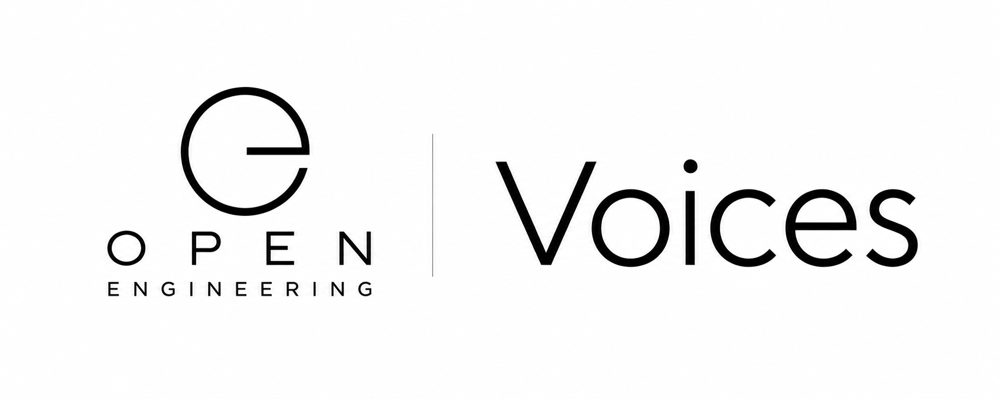

# Open Engineering Voices

**Give engineered systems a voice.**

<p align="center">
  
</p>

Open Engineering Voices is the home of the **voice, speech, conversation, and audible character layer** of the Open Engineering ecosystem.

It provides reusable definitions, components, runtimes, integrations, and patterns for enabling engineered entities — including **Picos**, robots, assistants, devices, simulations, and characters — to **listen, understand, speak, and participate in conversations**.

A Voice is not merely text-to-speech.

It is the audible expression of an engineered entity.

---

## What is a Voice?

In Open Engineering, a **Voice** is a composable capability that connects an entity to the spoken world.

A Voice can provide:

```text
Human
  │
  │ speech
  ▼
┌───────────────────────────────┐
│            Voice              │
│                               │
│  Listen → Understand → Speak  │
└───────────────┬───────────────┘
                │
                │ events / intent
                ▼
              Pico
                │
                ▼
        Open Engineering
```

Depending on its composition, a Voice may include:

- microphone and audio input
- voice activity detection
- wake-word detection
- speech-to-text
- intent and conversational interpretation
- interaction with local or remote language models
- text-to-speech
- voice identity
- pronunciation and prosody
- sound effects and non-verbal expression
- streaming audio
- event and message integration
- character behaviour
- privacy and locality policies

The Voice remains separate from the entity using it.

That separation allows the same Pico or character to acquire different voices without changing its underlying identity or behaviour.

---

## Voices and Picos

A **Pico** is a small, composable engineered entity.

A Pico may exist without a Voice.

When a Voice is attached, the Pico gains an audible interface to people and other entities.

```text
┌─────────────────────────────────────┐
│                Pico                 │
│                                     │
│   Identity                          │
│   State                             │
│   Behaviour                         │
│   Memory                            │
│   Events                            │
│                                     │
│       ┌─────────────────────┐       │
│       │        Voice        │       │
│       │                     │       │
│       │ Listen              │       │
│       │ Understand          │       │
│       │ Speak               │       │
│       └─────────────────────┘       │
│                                     │
└─────────────────────────────────────┘
```

This makes voice a **capability**, rather than something hard-coded into an application.

---

## Voice as Composition

Open Engineering favors composition over monolithic voice assistants.

A Voice can therefore be assembled from replaceable components:

```text
Microphone
    │
    ▼
Voice Activity Detection
    │
    ▼
Wake Word
    │
    ▼
Speech-to-Text
    │
    ▼
Conversation / Intent
    │
    ▼
Pico / Agent / System
    │
    ▼
Text-to-Speech
    │
    ▼
Speaker
```

Each stage can evolve independently.

For example, a completely local implementation might use local speech recognition, a locally hosted language model, and local speech synthesis, while another implementation could deliberately compose cloud services.

The architecture should make that a deployment decision rather than an application rewrite.

---

## Local First

Voice is unusually sensitive data.

Open Engineering Voices therefore treats **local execution as a first-class architecture**, particularly for:

- microphone streams
- conversations
- wake-word detection
- speech recognition
- language-model inference
- speech synthesis
- character interactions

Where practical, audio should remain close to the entity producing or consuming it.

Cloud services remain possible, but they should be explicit architectural choices rather than invisible dependencies.

```text
        ┌──────────────────────────────┐
        │        Local Runtime         │
        │                              │
Human ─►│ STT → Intelligence → TTS    │─► Human
        │                              │
        │      Open Engineering        │
        └──────────────────────────────┘
```

---

## Voices and Characters

Speech alone does not create character.

A character's Voice may additionally describe:

- vocabulary
- speaking style
- cadence
- emotional range
- pronunciation
- pauses
- non-verbal sounds
- conversational behaviour
- response boundaries

This enables an Open Engineering Character to retain a recognizable audible identity while its underlying speech technology changes.

```text
Character
   │
   ├── Identity
   ├── Personality
   ├── Behaviour
   └── Voice
        │
        ├── Speech
        ├── Prosody
        ├── Vocabulary
        └── Expression
```

The goal is not simply to make machines talk.

The goal is to make their communication **intentional, understandable, inspectable, and composable**.

---

## Event-Driven Voice

A Voice should also participate naturally in event-driven systems.

Instead of coupling speech directly to application logic:

```text
"I am ready."
      │
      ▼
    Voice
      │
      ▼
voice.spoken
      │
      ▼
 Event / Message
      │
 ┌────┴───────────────┐
 ▼                    ▼
Pico               Workflow
 │                    │
 ▼                    ▼
State              Actions
```

Likewise, an incoming event can cause an entity to speak:

```text
system.alert
     │
     ▼
   Voice
     │
     ▼
"Something needs your attention."
```

This allows voice to integrate naturally with Open Engineering's **Events, Messaging, Workflow, Observation, and Execution** primitives.

---

## Voice Definitions and Implementations

Open Engineering distinguishes between **what something is** and **how it is implemented**.

A Voice definition can describe capabilities and behaviour independently from a particular speech engine.

For example:

```yaml
apiVersion: voices.open-engineering.io/v1alpha1
kind: Voice
metadata:
  name: pico
spec:
  language: en
  capabilities:
    - listen
    - transcribe
    - converse
    - speak
```

An implementation can then bind those capabilities to concrete components.

This separation makes Voices:

- portable
- replaceable
- testable
- versionable
- deployable
- observable

---

## Voice Runtime

A typical Open Engineering Voice runtime may span several environments:

```text
Edge / Device
     │
     │ audio / events
     ▼
Voice Runtime
     │
     ├── Speech Recognition
     ├── Conversation
     ├── Local LLM
     ├── Speech Synthesis
     └── Audio Processing
     │
     ▼
Messaging
     │
     ▼
Kubernetes
     │
     ├── Picos
     ├── Workflows
     ├── Observability
     └── Home Automation / Robotics
```

This makes Voices useful far beyond traditional assistants.

They can become interfaces for:

- robots
- animatronics
- smart environments
- digital twins
- educational systems
- demonstrations
- interactive installations
- developer tools
- accessibility systems
- autonomous agents

---

## Open Engineering Architecture

Voices participate in the broader Open Engineering model:

```text
Definitions
     │
     ▼
Conventions
     │
     ▼
Parsers
     │
     ▼
Rules
     │
     ▼
Capsules
     │
     ▼
Composers
     │
     ▼
Picos
     │
     ├──────── Voice
     │
     ▼
Runtime
     │
     ▼
Kubernetes
```

Voice therefore isn't a separate AI subsystem.

It is another composable Open Engineering capability.

---

## Engineering Principles

Open Engineering Voices follows a few core principles.

**Composable by default.** Speech recognition, language models, synthesis, audio processing, and transport should remain replaceable.

**Local-first.** A useful Voice should be able to operate without requiring a permanent cloud dependency where the available hardware permits it.

**Event-driven.** Voice input and output should participate in the same event architecture as the rest of the engineered system.

**Observable.** Listening, interpretation, decisions, speech generation, latency, and failures should be inspectable.

**Declarative.** Desired Voice behaviour should be describable independently from runtime implementation.

**Character-aware.** A Voice may express identity and character without coupling those concepts to a particular speech engine.

**Human-centered.** People must be able to understand when a system is listening, processing, speaking, unavailable, or uncertain.

---

## Example: Hello, Pico!

The smallest useful experiment is deliberately simple:

```text
Human
  │
  │ "Hello, Pico!"
  ▼
Voice
  │
  ▼
Speech-to-Text
  │
  ▼
Pico
  │
  │ event
  ▼
Voice
  │
  ▼
Text-to-Speech
  │
  ▼
"Hello!"
```

Yet this small interaction exercises an entire engineering chain:

**audio → recognition → events → Pico → response → synthesis → audio**

That makes voice an excellent way to make otherwise invisible distributed-system behaviour tangible.

---

## From Voice to Presence

The longer-term ambition is larger than speech.

Combine:

```text
Voice
  +
Character
  +
Memory
  +
Vision
  +
AI
  +
Robotics
  +
Identity
```

and an engineered entity begins to acquire something closer to **presence**.

It can perceive.

It can remember.

It can act.

And with a Voice, it can communicate.

---

## Part of Open Engineering

Open Engineering Voices belongs to the wider **Open Engineering** ecosystem: an effort to make complex engineered systems understandable, composable, reproducible, and open.

Voices provide the bridge between those systems and one of humanity's most natural interfaces:

**conversation.**

---

## Status

Open Engineering Voices is under active development.

Interfaces, definitions, conventions, and runtime implementations should be expected to evolve as the Open Engineering model matures.

Contributions, experiments, implementations, and discussion are welcome.

---

<p align="center">
  <strong>Open Engineering Voices</strong><br/>
  Listen. Understand. Speak.
</p>
